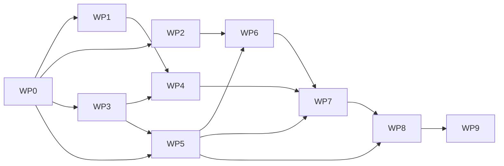

<!-- SPDX-License-Identifier: GPL-2.0-or-later -->

# Browser arena: prototype work packages

**Status:** Independently reviewed and approved; WP0 complete

This document turns the reviewed direction in
[`initial-plan.md`](initial-plan.md) into coherent, testable increments. It
covers the first browser-arena vertical slice only. Later product integration
is represented by a final design package, not silently included in the
prototype.

## How to use this plan

A work package is complete only when all of the following are true:

1. Its build and source inputs are immutable and publicly obtainable. A routed
   acceptance environment may be supplied at runtime only where the WP names
   it explicitly; its public contract and non-secret evidence remain complete.
2. Its automated checks and manual acceptance have passed.
3. The complete diff has received a review proportional to its risk.
4. Review findings are fixed or recorded as an explicit blocker.
5. New system facts and decisions are reflected in the public documentation.
6. Changed submodules are committed and pushed before their pins move here.

Generated build and content artifacts are evidence, not Git inputs, unless a
later distribution contract explicitly says otherwise. Evidence records must
identify the input commits and digests, commands, target environment and output
digests well enough for a reviewer to repeat the result.

The current default acceptance platform is Linux x86_64 with an exact
Chrome-for-Testing version. WP0 freezes the full version string, archive digest
and desktop OS contract before implementation begins. Replacing this platform
is a plan change; adding another platform is later scope.

## Delivery map

| WP | Outcome | Depends on | State |
| --- | --- | --- | --- |
| WP0 | Immutable toolchain and acceptance baseline | — | ✅ Complete — exact public pins, closed license/tree inventory, schemas, relay vector and fail-closed validation |
| WP1 | Reproducible unmodified ioq3 browser build | WP0 | Approved |
| WP2 | Relay conformance probe and routed-path measurement | WP0 | Approved |
| WP3 | Audited deterministic minimal-content closure | WP0 | Approved |
| WP4 | One-map offline browser arena with bots | WP1, WP3 | Approved |
| WP5 | Matching native server and packet census | WP0, WP3 | Approved |
| WP6 | Measured network-sizing decision | WP2, WP5 | Approved |
| WP7 | Browser backend and matching server rebuild | WP4, WP5, WP6 | Scope gate |
| WP8 | Two-browser multiplayer acceptance | WP5, WP7 | Scope gate |
| WP9 | Public product-integration blueprint | WP8 | Scope gate |

WP1, WP2 and WP3 are independent after WP0 and may be scheduled separately.
WP4 and WP5 may proceed independently after WP3. WP7 must not be approved or
implemented until WP6 has selected the transport and sizing strategy from
measured evidence.

## WP0 — Immutable baseline

### Outcome

The repository can identify every tool and acceptance environment used by the
prototype without a moving tag, an ambient host dependency or an undocumented
download.

### Scope

- Record the existing ioq3 submodule commit as the engine and bundled
  `baseq3` gamecode input, with a closed component-level license inventory
  rather than a blanket engine license. Express the GPL core as `code/` minus
  every separately licensed directory, prebuilt library, build tool and
  source-file exception; paths may not overlap silently.
- Pin the Emscripten builder by exact version and platform-specific OCI digest.
  The selected target is Emscripten 6.0.8; ioq3 CI's 3.1.58 remains recorded
  reference evidence. The baseline records the upgrade reason and maps the
  selected target to its OCI index and platform-manifest digests.
- Pin the native builder base by platform-specific digest. It is build-only,
  not a base for a distributed runtime image.
- Pin one Linux x86_64 Chrome-for-Testing archive by full version, public URL
  and cryptographic digest, plus the exact desktop OS version used for manual
  acceptance and the signed checksum identity for its installation medium.
- Define the machine-readable lock and provenance formats used by later WPs.
- Define the canonical artifact-manifest format and digest algorithm.
- Record the routed-browser trust mechanism: public Web PKI or a pinned
  `serverCertificateHashes` certificate satisfying browser constraints. Do not
  rely on an undocumented machine-wide trust-store change.
- Record the game-neutral WP2 measurement vector, including boundaries around
  1,300, 1,307, 1,309, 1,312 and 1,314-byte inner UDP datagrams, useful
  resolution below those boundaries and explicit oversized cases through
  ioq3's 16,384-byte message bound.
- Add validation that rejects moving references, missing digests, unknown
  licenses and incomplete preferred-source records. Exercise all published
  schemas with committed or test fixtures and prove load-bearing rejection
  paths with negative tests. Bind validation to the staged submodule URL and
  branch metadata and gitlink that form the commit candidate, reject unstaged
  `.gitmodules` changes, require a clean ioq3 checkout and check the reviewed
  third-party/tool inventory against that tree.

### Acceptance evidence

- A clean checkout validates every committed lock without performing a build.
- Every network input is an immutable commit, exact archive plus digest, or
  platform-specific image digest.
- The browser and builder can be obtained from only the committed public
  metadata.
- The provenance schema distinguishes code licenses from separately aggregated
  content licenses and records per-member role, obligations and resolved notice
  members.
- Generated artifact and content records bind themselves to the exact baseline
  identity; every declared baseline input agrees with its locked kind and
  immutable identity.
- `git diff --check` and the lock/provenance validators pass.
- The canonical baseline SHA-256 is documented, and later manifest/provenance
  identities are explicitly reissued after any baseline byte change.

### Explicit non-goals

- Compiling ioq3.
- Downloading or selecting game content.
- Modifying the ioq3 fork.
- Defining production deployment or secrets.

### Review

Focused reproducibility and licensing review of the lock formats, validators
and every initial pin.

## WP1 — Reproducible upstream browser build

### Outcome

A clean checkout reproducibly builds the pinned ioq3 Emscripten target without
product networking or engine-source changes and emits an exact artifact
manifest.

### Scope

- Add product-owned build orchestration around the official CMake/Emscripten
  target.
- Start each accepted build from a deleted build tree.
- Keep build output outside Git and produce a deterministic manifest of the
  JavaScript, WebAssembly, data and generated shell/configuration artifacts.
- Bind the manifest to WP0 and require `ioq3` and `emscripten-builder` as exact
  baseline inputs; renamed or digest-divergent substitutes fail the build.
- Run two clean builds in the pinned builder and compare their artifacts.
- Verify the existing upstream path in which Emscripten disables native game
  libraries but leaves QVM builds enabled. Use a separate, equally pinned
  host-tools phase only if the clean build disproves that prior evidence.
- Map every WP0 engine component to the observed preprocessing, compilation,
  link or exclusion result. In particular, confirm or correct whether the
  OpenAL snapshot is interface-header-only, whether SDL/curl/Mumble/updater and
  prebuilt SDL libraries are excluded, and which minizip, codec and renderer
  exceptions enter the browser artifact.
- Record whether QVM generation executes the restrictive lcc build tool. Keep
  lcc source/executables out of distributable browser and native artifacts and
  stop for a release-policy review if the intended distribution would exceed
  WP0's public-source-submodule boundary.
- Audit the version-sensitive SDL port, filesystem export and ES-module settings
  explicitly during the 3.1.58-to-6.0.8 compatibility gate.
- Audit and record the actual linked license closure, including runtime code
  supplied by Emscripten rather than the ioq3 checkout, and assemble the notices
  and corresponding-source obligations needed for browser distribution.
- Record whether the resulting client actually requires cross-origin isolation;
  the current non-threaded link configuration suggests that it may not.
- Treat the generated upstream shell and retail-data configuration only as
  build evidence; do not package them as the product loader.

### Acceptance evidence

- Two clean builds from the same inputs produce identical artifact manifests
  and byte-identical distributable engine artifacts.
- Both accepted builds use Emscripten 6.0.8. A compatibility failure stops for
  review and cannot silently switch the accepted result back to 3.1.58.
- Compiler and tool versions in the log match WP0 exactly.
- No proprietary PK3 or other Quake III data is read or emitted.
- The output manifest identifies every artifact by size and cryptographic
  digest, names the exact WP0 baseline and agrees with its ioq3 and Emscripten
  identities.
- The license report distinguishes the GPL engine/QVM from every separately
  licensed linked component, has no unresolved provisional source-role claim
  and resolves all shipped notices.
- A documented command reproduces the result from a clean checkout.

This WP has no playable-runtime acceptance because free data has not yet been
selected. A successful compile is the complete intended outcome.

### Failure boundary

If the pinned upstream tree cannot build without an engine change, stop this WP
and propose a narrowly scoped ioq3 enablement WP. Do not create the `web` branch
or patch the engine as an unreviewed side effect.

### Explicit non-goals

- Product browser shell or UX.
- Content assembly or offline play.
- Browser networking.
- Native server container.

### Review

Build/reproducibility review of scripts, clean-build enforcement, toolchain
identity and artifact comparison.

## WP2 — Relay conformance probe and routed-path measurement

### Outcome

A reviewer can run a public standalone browser probe against a compatible
shared WebTransport-to-UDP relay and measure the usable routed datagram path
without ioq3. This repository does not create a second relay server.

### Scope

- Specify the game-destination subset of the public protocol needed for
  authorization, one virtual client address, one pinned virtual destination,
  keep-alive and bidirectional datagrams. Write it independently from observed
  wire behavior; copied implementation text or code retains its source notice.
- Specify the fixed framing: a 40-byte relay header, one or more big-endian
  `u16`-length-prefixed UDP datagrams from browser to server, and exactly one
  such UDP datagram from server to browser. A single datagram therefore adds
  42 bytes, and its destination port must match the projected endpoint exactly.
- Add a small browser probe that accepts an endpoint, certificate/trust input,
  short-lived authorization and virtual destination at runtime and commits none
  of those environment-specific values.
- Separate protocol framing and measurement logic from the browser transport so
  deterministic tests can exercise them with an in-memory adapter.
- Send the WP0 measurement vector, adjacent boundary sizes and session-specific
  payload-prefix nonces in both directions through a configured UDP echo
  destination behind the relay. Run payloads smaller than the nonce
  sequentially. Include single-datagram cases in both directions and bounded
  packed multi-datagram cases only from browser to server, matching the
  asymmetric framing contract, while keeping the probe implementation
  game-neutral.
- Run the public probe across at least one routed network path. Keep endpoint
  details out of the repository and record only non-secret topology
  characteristics.
- Record the browser-reported datagram size, successful payload range and
  failure behavior for each accepted session. Verify the known 42-byte
  single-datagram framing overhead rather than treating it as a measured
  transport constant.
- Derive a conservative payload budget from repeated sessions. This is an
  input to WP6, not permission to change ioq3 packet sizing.

### Acceptance evidence

- Automated probe tests reject missing runtime configuration, malformed relay
  frames, mismatched nonces and out-of-range measurement records.
- The routed endpoint rejects invalid authorization and accepts a fresh
  short-lived authorization for only the configured virtual destination.
- Two concurrent probe sessions with distinct virtual addresses and fresh
  single-use allowances receive only their own nonce-tagged echo traffic.
- Boundary tests cover empty, maximum accepted and oversized datagrams in both
  directions without unbounded allocation or an uncaught browser failure.
- The real pinned browser completes repeated probe sessions and emits a
  machine-readable measurement report for the routed path.
- The report preserves per-session/per-path results and does not present one
  observed browser maximum as a universal transport constant.
- A clean public checkout can run every deterministic probe test and can repeat
  the routed acceptance when supplied a compatible endpoint and one-time
  credentials.
- The published game-destination contract and in-memory adapter are complete
  enough for an independent implementation to satisfy the same conformance
  tests without access to the operational relay source.

### Explicit non-goals

- A relay server implementation or game-specific proxy container.
- Environment-specific relay deployment, credentials or operational details.
- ioq3 or game-protocol awareness.
- Tunnel fragmentation, WebSocket fallback or stream-assisted game traffic.
- Multi-server routing or public server discovery.

### Review

Protocol/client review covering runtime secret handling, framing, session
isolation and measurement correctness. Relay-side changes receive their own
review in the repository that owns the shared implementation.

## WP3 — Audited minimal-content closure

### Outcome

The repository can deterministically assemble a candidate one-map FFA content
pack from verified free sources, with complete member-level provenance and no
proprietary Quake III data.

### Scope

- Select one map, one player presentation, required weapons/effects, bot data,
  fonts, menus, sounds and the smallest static dependency closure needed for
  the prototype.
- Prefer sources with a verified free license and obtainable preferred source
  form. Aesthetics break ties only after provenance and closure size.
- Record every upstream input by immutable revision or archive digest.
- Record each output member's source, license, notice requirements,
  transformation and preferred source form.
- Build deterministic PK3 output and a sorted member/digest manifest.
- Add static reference checks for missing shaders, textures, models, sounds,
  bot files and menu data where the formats permit it.
- Keep OpenArena gamecode out of the pack: the candidate targets the pinned
  ioq3 `baseq3` QVMs selected by the prototype plan.

### Acceptance evidence

- Every generated member has a provenance entry and an allowed free license.
- No non-commercial, no-derivatives, unknown-license or proprietary input is
  present.
- Two clean assemblies produce byte-identical PK3 files and manifests.
- The archive member list is deterministic and contains no ambient timestamps,
  local paths or untracked input.
- Static closure checks report no unresolved required member.
- The license report includes all attribution and source-offer obligations
  needed to distribute the candidate pack.

### Failure boundary

Runtime compatibility with `baseq3` QVMs is proved in WP4. If the selected
closure cannot support that profile, WP4 stops and the plan is reviewed; OA
gamecode is not added silently.

### Explicit non-goals

- A complete OpenArena distribution.
- Additional maps, modes, player models or cosmetic variants.
- Automatic server downloads or user-supplied retail data.
- Checking generated PK3 files into Git.

### Review

Full provenance/license review plus a focused deterministic-build and content-
closure review.

## WP4 — Offline browser vertical slice

### Outcome

The pinned browser build, ioq3 `baseq3` QVMs and WP3 content form a playable
one-map FFA experience with offline bots in the real WP0 browser.

### Scope

- Add the product-owned browser loader and content configuration.
- Package only allowlisted WP1 runtime artifacts and the exact WP3 content.
- Start directly into the one-map FFA profile with at least one bot.
- Implement only the loader behavior needed for canvas sizing, pointer lock,
  keyboard/mouse input, fullscreen and user-activated audio.
- Record load timing, frame timing, console errors and exact runtime identities.
- Verify focus loss/recovery and a second clean launch.

### Acceptance evidence

- The exact WP0 browser loads from a clean local serve and enters the map
  without proprietary files or network-fetched game media.
- The user can move, look, fire, take/deal damage, score and complete or restart
  an FFA session with bots.
- Pointer lock, keyboard/mouse input, fullscreen, audio activation and focus
  recovery work in a real visible browser.
- Client console and browser console contain no missing required asset, QVM
  rejection, uncaught exception or WebGL fatal error.
- Runtime engine, QVM and PK3 identities match committed manifests.
- A repeat launch uses only declared local artifacts and reaches the same
  profile.

### Failure boundary

If free content cannot support the pinned ioq3 `baseq3` QVMs, stop and return
to plan review with concrete missing contracts. Switching gamecode or adopting
the OpenArena engine is outside this WP.

### Explicit non-goals

- Multiplayer or browser network backend.
- Persistent settings, OPFS, accounts or launcher integration.
- Additional maps/modes, touch input or non-Chromium browsers.
- Production hosting and caching policy.

### Review

Browser-shell/code review plus witnessed real-browser acceptance. Headless
rendering alone is insufficient.

## WP5 — Matching native server and packet census

### Outcome

A pinned native client can complete the same FFA profile against a matching
containerized dedicated server, and the session produces a trustworthy packet-
size census for WP6.

### Scope

- Build the native dedicated server from the WP0 engine commit, a separately
  pinned WP5 runtime base and the exact WP3 QVM/content identities. The runtime
  base must record its distribution and preferred-source obligations and must
  not inherit the build-only WP0 Ubuntu builder.
- Add a minimal server configuration for the single FFA map and bots.
- Build or pin a matching native test client without proprietary data.
- Run connection, representative FFA/bot play, disconnect and reconnect while
  capturing packet sizes in both directions.
- Distinguish netchan traffic from connectionless handshake/query traffic.
- Record observed maximums and distributions at the engine/UDP boundary,
  including the client-to-server and server-to-client header asymmetry.
- Record the effects of all relayed players sharing the relay's base IPv4
  address: query/challenge rate limits and address bans do not distinguish the
  per-player UDP source ports.
- Keep instrumentation outside the game protocol where possible.

### Acceptance evidence

- A native client connects, joins, plays, scores, disconnects and reconnects
  against the containerized server.
- Client and server QVM/PK3 identities agree exactly and no media download is
  attempted.
- The server container starts from an empty writable state and needs no
  undeclared host content.
- A machine-readable census covers initial queries, challenge/connect,
  gamestate, representative play and disconnect in both directions.
- The raw capture or equivalent preferred evidence can be regenerated without
  logging credentials or unrelated host traffic.

### Explicit non-goals

- Browser networking or WebTransport.
- Public master-server registration.
- General compatibility with OpenArena or retail Quake III clients.
- Production resource limits, orchestration or persistent worlds.

### Review

Container/supply-chain review plus independent validation that the census
covers connectionless and netchan traffic and measures the correct boundary.

## WP6 — Measured network-sizing decision

### Outcome

A reviewed decision combines WP2's browser-path budget with WP5's game packet
census and selects exactly one bounded transport strategy before engine network
work begins.

### Scope

- Compare conservative per-direction WebTransport payload budgets, relay
  overhead and the full native census, including connectionless packets.
- Derive code-level packet bounds for the fixed prototype profile and generate
  boundary cases that may not occur in a short observed session.
- Replay worst-case recorded packet shapes through the shared relay where
  possible.
- Select one strategy in this ownership order unless evidence justifies
  otherwise: intact datagrams with no engine change; a symmetric documented
  fragment-size reduction in the pinned browser and server engines; or bounded
  fragmentation implemented and reassembled by that matching engine pair.
  The working scheduling assumption is the symmetric reduction because one
  1,314-byte ioq3 datagram becomes a 1,356-byte relay payload.
- Treat stream-assisted game traffic as a separately owned shared-relay change.
  Selecting it requires a new cross-repository plan and review; WP6 cannot
  authorize it inside this repository.
- Specify all packet, fragment, byte, count and timeout limits required by the
  selected strategy.
- Specify behavior when the live browser budget is below the accepted floor or
  changes during a session.
- Freeze numeric WP8 acceptance thresholds for connection success, unexpected
  disconnects, reconnects, frame pacing, packet failures and latency overhead.
- Replace WP7 and WP8's scope-gate text with implementation-ready contracts and
  review them before WP7 starts.
- Require WP7 to rebuild and re-census the native server from the final `web`
  engine pin whenever the selected strategy changes server-side packet logic.

### Acceptance evidence

- Every input report identifies exact WP0/WP2/WP5 commits and artifact digests.
- Arithmetic includes relay overhead and separate direction/header cases.
- Connectionless traffic is covered explicitly; netchan fragmentation is not
  assumed to protect it.
- The selected strategy fits every accepted observed packet within a documented
  safety margin and covers the generated profile boundary cases, or defines an
  explicit bounded alternate path.
- A reviewer can recompute the decision from committed reports and scripts.
- WP7 contains no transport mechanism that this decision did not authorize.
- The decision identifies every changed owning component and the exact
  post-change browser/server rebuild and census evidence required from WP7.

### Explicit non-goals

- Implementing the ioq3 browser network backend.
- Treating a single browser session's reported maximum as a universal constant.
- Quietly lowering only one endpoint's packet sizing.
- Adding WebSocket fallback without a new plan review.

### Review

Mandatory independent protocol/security review. Any finding affecting the
strategy, bounds or census reopens WP6 and keeps WP7 blocked.

## WP7 — Browser backend and matching server rebuild

**State:** Scope gate. This is an outcome envelope, not an authorized
implementation WP. WP6 must replace the conditional parts and obtain review.

### Outcome envelope

One WP0 browser client obtains fresh authorization, addresses the pinned
virtual destination and completes the single-map FFA profile through the
shared relay. Its matching native server is rebuilt from the same final engine
pin and re-censused when WP6 changes server-side packet logic.

### Fixed boundaries

- Create and publish the ioq3 fork's `web` branch before the first engine
  modification, then update this repository's branch metadata and exact pin.
- Keep the low-level engine/backend change in ioq3 and product loader/token
  plumbing in this repository.
- Choose and document one seam: platform socket replacement or the existing
  engine send/receive boundary.
- Bridge asynchronous WebTransport receipt to synchronous engine polling with
  an explicitly bounded queue and defined overflow/shutdown behavior.
- Use a token-provider hook that obtains a fresh short-lived, single-use
  allowance for every connection or reconnect attempt; never reuse a static
  credential.
- Implement the protocol keep-alive required for an idle authenticated session.
- Preserve the engine's datagram semantics and WP6 bounds.
- Fail closed on invalid authorization, unknown destination, path-budget
  violation and relay closure.
- Add no transport mechanism not selected by WP6.

### Minimum acceptance envelope

- Automated native/unit tests cover address conversion, queue limits, send and
  receive failures, shutdown and any WP6 framing logic.
- The exact browser connects through the shared relay to the exact server and
  can join, move, fire, score, disconnect and reconnect.
- If WP6 changed server-side packet logic, the server is rebuilt from the same
  final `web` pin, its WP5 profile is re-censused and every WP6 bound still
  passes before browser acceptance.
- No packet is delivered across browser sessions or outside the authorized
  virtual destination.
- Browser and server logs demonstrate exact engine/QVM/content identity.
- Real-browser acceptance passes without uncaught promise failures, unbounded
  queues or a main-thread busy loop.

### Explicit non-goals

- Two-player endurance acceptance, which belongs to WP8.
- Production deployment, public server lists or arbitrary server addresses.
- Other browsers, mobile/touch, content downloads or persistent settings.

### Review

Independent ioq3 diff review and protocol/security review are mandatory before
the ioq3 pin moves here.

## WP8 — Two-browser multiplayer acceptance

**State:** Scope gate. WP6 supplies numeric thresholds; WP7 supplies the final
artifact and observability. Both must be reviewed before WP8 is approved.

### Outcome envelope

Two instances of the pinned browser client, originating from two independent
client networks, complete a sustained FFA session through the relay to the
matching native server while meeting the frozen WP6 thresholds.

### Fixed acceptance topology

- Two independently addressed client networks and one server-side observation
  point.
- One exact browser/OS contract and identical client artifacts.
- At least 15 minutes of active two-player FFA after both clients join.
- Planned disconnect/reconnect exercises for each client.
- Server-side evidence that both players appear only as the relay's IPv4
  endpoint with distinct per-player source ports, and that neither player's
  public address appears.

### Evidence envelope

- Connection/reconnect success, unexpected disconnect and packet-send failure
  counts.
- Browser- and server-side per-session evidence for packet sizes, drops,
  ordering/reassembly failures if applicable and bounded queue behavior.
- Relay-side non-identifying aggregate counters for rate-limit and malformed or
  rejected traffic; do not require per-session relay metrics that do not exist.
- End-to-end latency and relay-added overhead against the WP6 baseline.
- Browser frame-time distribution, long tasks, console errors and memory/queue
  growth over the session.
- Server logs and packet observations sufficient to verify relay-mediated
  privacy without recording player public addresses in committed evidence.

### Explicit non-goals

- Load testing beyond two players.
- Browser-hosted or peer-to-peer multiplayer.
- Production SLOs, autoscaling or Internet-wide compatibility.
- Accounts, progression, matchmaking, public catalogue or moderation.
- Declaring support for untested browsers/platforms.

### Review

Acceptance-evidence review plus a final vertical-slice review across the public
loader, ioq3 pin, relay contract, content manifest and server artifact.

## WP9 — Product-integration blueprint

**State:** Scope gate. Begin only after WP8 closes the technical vertical slice.

### Outcome envelope

A public, implementation-ready design describes how the proven artifacts can
be hosted and operated without folding unrelated product features into the
prototype.

### Design topics

- Browser launch and error UX.
- Persistent settings and content caching.
- Immutable artifact publication and cache invalidation.
- Server catalogue and launch metadata boundaries.
- Authentication-token handoff through the public relay contract.
- Consequences of all relayed players sharing one server-visible base IPv4 for
  query rate limits, bans and abuse controls.
- Health/probe behavior and native-server lifecycle/resource contracts.
- Source, license, notice and artifact delivery obligations.
- Separation between public reusable components and environment-specific
  deployment configuration.

### Explicit non-goals

- Implementing the hosting application or deployment.
- Accounts, progression, moderation or a general id Tech 3 platform.
- Reopening the proven transport strategy without new measurements.

### Review

Architecture, security, licensing and operability review before any product
integration implementation is scheduled.

## Review checkpoints

1. **Plan approval:** completed. WP0–WP6 and the WP7–WP9 envelopes are approved;
   WP0 is the first authorized implementation increment.
2. **Early evidence:** after WP1–WP3, review build reproducibility, browser-path
   measurements and content provenance before assembling the playable slice.
3. **Network gate:** WP6 independently reviews the measurements and replaces
   WP7/WP8's scope gates with exact implementation and acceptance contracts.
4. **Vertical-slice closure:** WP8 reviews the complete two-client evidence
   before WP9 or any hosting integration begins.

## Input still needed from the operator

No additional input is needed to review or begin WP0 if the Linux x86_64
Chrome-for-Testing default is acceptable. Before WP2's routed-path acceptance,
the operator must provide or approve a compatible integration relay endpoint,
a browser-compatible trust mechanism, a UDP echo destination, two distinct
virtual addresses and enough fresh single-use allowances for every session.
Before WP7/WP8 routed acceptance, the integration environment must provide a
fresh-token issuer or equivalent harness and host the matching rebuilt native
server behind an exact virtual-address/UDP-port route. Before WP8, the operator
must also provide or approve access to two independent client networks for the
privacy and multiplayer acceptance. Product naming, additional platforms and
production deployment choices are deliberately not prerequisites for this
prototype.
